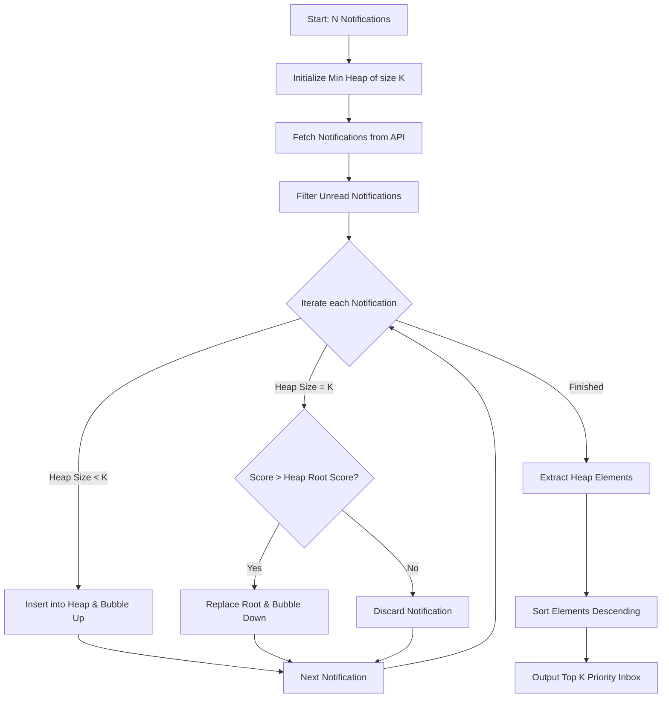

# Notification Priority Inbox - System Design Document

This document outlines the system design, algorithms, complexity analysis, and architecture of the Priority Inbox System.

---

## 1. Problem Statement
Campus notification systems receive a high volume of updates across various categories (e.g. placements, academic results, events). Users can quickly suffer from information overload. To ensure that critical time-sensitive announcements (e.g., placement offers, deadlines) are highlighted immediately, the system requires a mechanism to retrieve, filter, and score notifications, returning the top $K$ ($K=10$) priority notifications.

## 2. Priority Logic
Each notification has:
- A category `Type` ($T \in \{\text{Placement}, \text{Result}, \text{Event}\}$)
- A string `Timestamp` representing when it was created

### A. Weight Assignment ($w$)
- **Placement**: $w = 3$ (Highest priority)
- **Result**: $w = 2$ (Medium priority)
- **Event**: $w = 1$ (Lowest priority)
- Unknown categories default to $0$

### B. Priority Formula
The score $S$ combines the priority weight and recency (expressed in epoch milliseconds, $t_{\text{ms}}$):
$$S = (w \times 1,000,000) + t_{\text{ms}}$$

This formula ensures that category category weight strictly dominates recency for normal ranges, while newer notifications of the same category are ranked higher.

---

## 3. Min Heap / Priority Queue Approach
To retrieve the top $K$ priority notifications from a stream of $N$ notifications, a fixed-size **Min Heap** of size $K$ is used.

### Why a Min Heap?
A Min Heap keeps the element with the **minimum** priority score at the root.
- As we iterate through $N$ notifications, we insert the first $K$ elements directly.
- For each subsequent element:
  - If its priority score is greater than the minimum element (root of the heap), we discard the root and replace it with the new notification, bubbling it down to restore heap properties.
  - If its score is less than or equal to the root, we reject the notification.
- Once all $N$ notifications are processed, the heap contains the $K$ highest priority notifications.
- We then extract and sort these $K$ elements to display them in descending order (highest priority first).

---

## 4. Algorithm & Operations

### Time Complexity
- **Scoring and Filtering**: $O(N)$ to parse categories and convert timestamps.
- **Heap Insertion**:
  - For the first $K$ items: $O(K \log K)$
  - For the remaining $N-K$ items: replacing root and heapifying takes $O(\log K)$ per item in the worst case.
  - Overall time complexity: **$O(N \log K)$**. Since $K = 10$, this runs in linear time $O(N)$.
- **Sorting Output**: Sorting $K$ items takes $O(K \log K)$, which is constant time $O(1)$ since $K$ is fixed.

### Space Complexity
- **Space Complexity**: **$O(K)$** auxiliary space (for storing up to $K$ notifications in the heap). This is highly memory-efficient, requiring only $O(1)$ space for $K = 10$, regardless of how large $N$ is.

---

## 5. Scalability & Future Improvements

1. **Streaming and WebSocket Integration**: Instead of polling an HTTP REST endpoint, notifications can be pushed over WebSockets. The Min Heap can live in memory on the client/broker side to process events in real time.
2. **Database Persistence**: To scale across multiple client nodes or server restarts, the heap states can be synced using Redis sorted sets (ZSET) which use skip lists to support $O(\log N)$ updates.
3. **Decaying Recency (Time-to-Live)**: Over time, the timestamp value $t_{\text{ms}}$ could dominate older high-priority announcements. Implementing an exponential decay factor on older placement notifications can ensure that yesterday's events don't permanently block today's updates.
