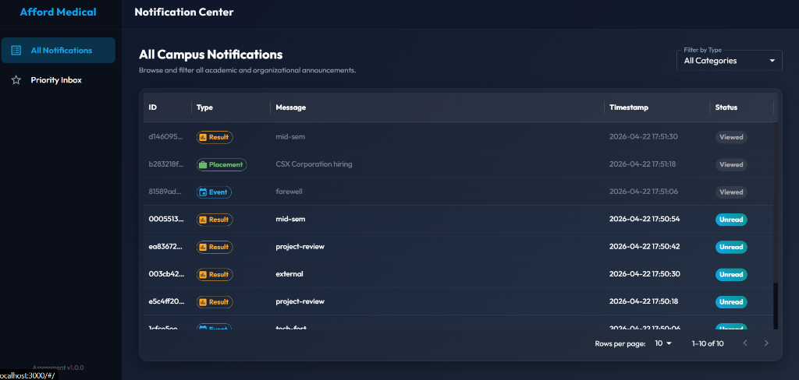
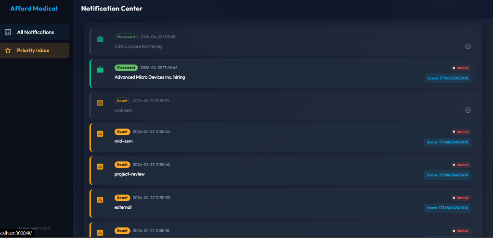

# Stage 2: React Notifications Web Application

This is a premium React web application built with TypeScript and Vite. It serves as a dashboard to view all campus notifications and a prioritized inbox, styled exclusively with **Material UI (MUI)**.

## 📸 Screenshots

### All Notifications Dashboard


### Priority Inbox View


## 📁 File Structure
- `src/components/ErrorBoundary.tsx`: Custom Error Boundary handling UI rendering crashes.
- `src/context/NotificationContext.tsx`: Context API managing state (loading, error, list mapping, and viewed notification indices).
- `src/hooks/useNotification.ts`: Custom hook to easily consume the notification context.
- `src/services/api.ts`: Setup for the Axios client. Integrates the API request and response interceptors (which act as the logging middleware). Contains helper formulas for scoring.
- `src/pages/AllNotifications.tsx`: DataGrid table rendering all notifications with filtering, unread highlights, and pagination.
- `src/pages/PriorityInbox.tsx`: Sorted priority list with a limit selector ($N \in \{10,15,20,25\}$).
- `src/utils/logger.ts`: Logger interface printing styled console messages for clicks, API, routing, info, and warnings.
- `App.tsx`: App shell layout (responsive navbar, drawers, theme definition).
- `main.tsx`: App mount point.
- `index.css`: Custom premium typography and scrollbars.

---

## ⚙️ Configuration

Create a `.env` file in the `stage-2` folder to configure connection parameters:
```env
VITE_NOTIFICATION_API_URL=http://4.224.186.213/evaluation-service/notifications
VITE_NOTIFICATION_API_TOKEN=your_authorization_token_here
```

---

## 🚀 Running the Web App

### 1. Install Dependencies
```bash
npm install
```

### 2. Run Dev Server (Port 3000)
```bash
npm run dev
```
Open [http://localhost:3000](http://localhost:3000) in your web browser.

### 3. Build for Production
To bundle the static files:
```bash
npm run build
```
The static build files will compile inside the `dist` directory.

---

## 🛡️ Key Technical Features

1. **Material UI Exclusivity**: Standard and responsive components, chips, selection controls, list tiles, theme configs, and MUI `DataGrid` tables.
2. **Context API State**: Centralized notification states, preventing prop-drilling.
3. **Local Storage Persistence**: List item read statuses persist in the user's browser across sessions.
4. **Re-usable Logging Middleware**:
   - **API Logging**: Logs Axios requests, responses, and network errors.
   - **Click Action Logging**: Logs navigation triggers and mark-as-read user actions.
   - **Route Change Tracking**: Hook-based route change auditor.
